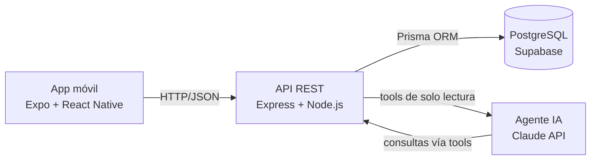

# Arquitectura – Fitness Tracker

Resumen de las decisiones técnicas del proyecto, para discutir con la cátedra.

## Vista general



- El teléfono no guarda datos: la app solo consume la API.
- La API es la única que habla con la base y con el modelo de IA. Las credenciales nunca viajan al teléfono.

## Componentes

### App móvil (`app/`)

- **Expo SDK 57 + React Native**, navegación con Expo Router (rutas por archivos).
- Cuatro secciones como pestañas nativas (`NativeTabs`, `UITabBarController` en iOS y Material en Android): **Dashboard**, **Salud**, **Entrenamiento**, **Comida**.
- UI con NativeWind (Tailwind) y componentes de React Native Reusables. Tema claro/oscuro.

#### Por qué React Native Reusables y no Expo Go (para explicar a la cátedra)

- El proyecto **no se inició con la plantilla por defecto de Expo ni se corre en Expo Go**. Se inicializó con la CLI de **React Native Reusables** (`@react-native-reusables/cli`), que arma un proyecto Expo ya configurado con NativeWind, tema claro/oscuro y una librería de componentes al estilo shadcn/ui: los componentes se copian al repo (`components/ui/`) y son código propio, no una dependencia cerrada.
- **Expo Go** es la app de prueba de Expo que solo soporta los módulos nativos que trae preinstalados. Esta app usa pestañas nativas (`NativeTabs`) y fuentes propias, cosas que Expo Go no puede cargar.
- Por eso se usa un **development build**: se compila la app nativa con `expo run:ios` / `expo run:android` (o EAS Build) y el servidor de desarrollo de Expo se conecta a ese build. Es el flujo recomendado por Expo para apps reales; Expo Go queda para prototipos.
- En resumen: Expo sigue siendo el framework (SDK, router, build), solo cambia el punto de partida (React Native Reusables) y la forma de correrlo (dev build en vez de Expo Go).

### Backend (`server/`)

- **Express 5 sobre Node.js**, escrito en TypeScript.
- Middlewares previstos: parseo JSON, CORS, autenticación, validación de bodies con Zod y manejo centralizado de errores.
- **Prisma 7** como ORM. La conexión se configura en `prisma.config.ts`; el cliente se genera en `src/generated` y usa el adaptador `@prisma/adapter-pg`.
- Endpoint de salud `GET /health` que verifica la conexión a la base.
- Identificación provisoria: header `x-user-id` (UUID generado por la app por dispositivo); el middleware crea el usuario si no existe. Se reemplaza por auth real más adelante sin cambiar el id.
- Rutas de salud bajo `/api/health`: `POST /sync` (payload de días + workouts + mediciones, lo que va a mandar la app desde HealthKit), `POST /import` (el `export.xml` crudo en el body; se parsea en streaming y entra por el mismo servicio), `GET /days`, `GET /workouts`, `GET /imports`.
- Ruta del agente: `POST /api/chat` recibe el historial de la conversación (`messages: [{role, content}]`) y devuelve `{ reply, toolCalls, model }`.

### Base de datos

- **PostgreSQL alojado en Supabase** (plan gratuito). Se usa solo como Postgres; no se usan Auth, Storage ni Realtime de Supabase.
- Elección frente a NoSQL: los datos son relacionales (usuarios, entrenamientos, ejercicios, series, comidas, alimentos, métricas por fecha) y SQL es más simple de consultar tanto para la API como para el agente. La cátedra confirmó que el requisito es el ORM Prisma, no el motor.
- El esquema está en `server/prisma/schema.prisma`, en cuatro grupos: usuarios; salud (`HealthImport`, `DailyHealthSummary`, `Workout`, `HealthSample`); entrenamiento (`Program` → `ProgramBlock` → `ProgramDay` → `ProgramExercise`, y lo realizado en `TrainingSession` → `SessionExercise` → `ExerciseSet`, con catálogo `Exercise`); comida (`Meal`, `MealItem`).
- Salud es un modelo híbrido: lo crudo de Apple Health (cientos de miles de muestras de frecuencia cardíaca, pasos, sueño) se queda en el teléfono; al servidor sube una fila por usuario y día (`DailyHealthSummary`), los entrenamientos del reloj (`Workout`) y algunas mediciones puntuales de pocas filas (peso, HRV, FC en reposo). Hay una sola ruta de ingesta con ese payload y dos productores: hoy el servidor, que parsea el `export.xml` subido en streaming y acumula por día; a futuro la app, que consulta las estadísticas diarias de HealthKit y manda lo mismo.

### Agente de IA

- Vive en el backend (`server/src/chat/`), detrás de `POST /api/chat`. La app hace **un solo request** por mensaje: manda el historial de texto y recibe la respuesta final. Todo el ida y vuelta con el modelo y la base pasa adentro del server.
- El modelo se llama a través de **OpenRouter**, que expone la misma API que OpenAI; se usa el SDK `openai` apuntando a `https://openrouter.ai/api/v1`. El modelo se elige con `OPENROUTER_MODEL` (default `google/gemini-3.1-flash-lite`; tiene que soportar tools). La API key nunca sale del server.
- Secuencia de un mensaje:
  1. Express arma el prompt de sistema (fecha de hoy, perfil del usuario, rango de datos cargados) y manda `system + historial + tools` al modelo.
  2. Si el modelo responde con `tool_calls`, Express ejecuta cada tool (consulta Prisma filtrada por el usuario), agrega el resultado como mensaje `tool` y vuelve a llamar al modelo. Máximo 6 vueltas por mensaje.
  3. Cuando el modelo responde con texto, se devuelve a la app junto con la lista de tools usadas.
- Tools disponibles (`tools.ts`): `get_daily_health` (resumen diario), `get_workouts` (entrenamientos del reloj), `get_measurements` (peso, HRV, FC en reposo, etc. por métrica) y `get_training_sessions` (sesiones de gym con series). Los parámetros se declaran con Zod y de ahí sale el JSON Schema que ve el modelo; el mismo esquema valida los argumentos que el modelo manda.
- El modelo nunca genera SQL ni accede a la base directamente. Esto acota el riesgo y hace auditables las consultas. Los resultados van recortados (sin nulls ni ids, con tope de filas por llamada) para no gastar contexto.
- Sin streaming ni persistencia de conversaciones por ahora: el historial vive en el estado de la pantalla.

## Entornos

| | Desarrollo | Producción |
|---|---|---|
| App | Dev build en simulador o celular, apunta a la IP local de la Mac (`EXPO_PUBLIC_API_URL`) | Build con EAS apuntando a la URL pública (`.env.production`) |
| API | `pnpm dev` en la Mac, puerto 3000 | Railway o Render, variables en el panel del hosting |
| Base | Supabase (misma instancia) | Supabase |
| Secretos | `server/.env` (ignorado por git) | Variables de entorno del hosting |

Al desplegar se corre `prisma migrate deploy` antes de iniciar la API para aplicar las migraciones pendientes.

## Estructura del repositorio

```
fitnessTracker/
├── app/                # rutas de Expo Router
│   ├── _layout.tsx     # layout raíz: fuentes, tema, Stack
│   └── (tabs)/         # pestañas: index (dashboard), salud, entrenamiento, comida, chat
├── components/         # componentes de UI
├── lib/api.ts          # cliente de la API (URL + header x-user-id)
├── server/             # API Express
│   ├── src/index.ts    # entrada del servidor
│   ├── src/health/     # ingesta (sync / import de Apple Health) y consultas
│   ├── src/chat/       # agente: ruta, loop con OpenRouter y tools de lectura
│   ├── src/lib/prisma.ts
│   ├── prisma/schema.prisma
│   └── prisma.config.ts
└── ARQUITECTURA.md
```

## Pendientes

- Primera migración (`prisma migrate dev`) y seed del catálogo de ejercicios.
- Importer del excel de la rutina.
- Autenticación de usuarios en la API.
- Endpoints CRUD por sección.
- Chat: streaming de la respuesta y persistir conversaciones.
- Deploy de la API.
